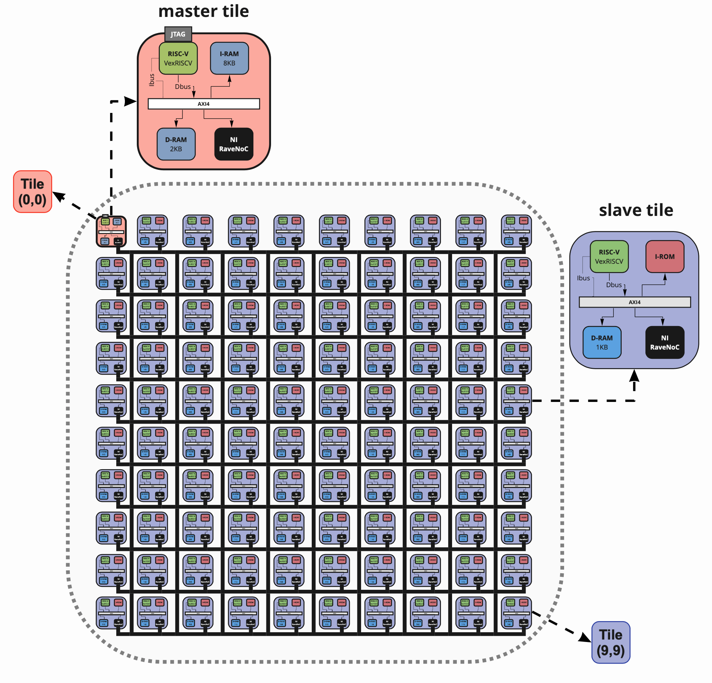

# 100x RISC-V cores MPSoC



Please read [this](https://aignacio.com/posts/hdls/mpsoc_riscv/) to understand the design.

To build the design and run sims with Verilator:
```bash
make all
```

To open waves with gtkwave:
```bash
make wave
```

To build for Xilinx FPGA Kintex 7:
```bash
make fpga
```
